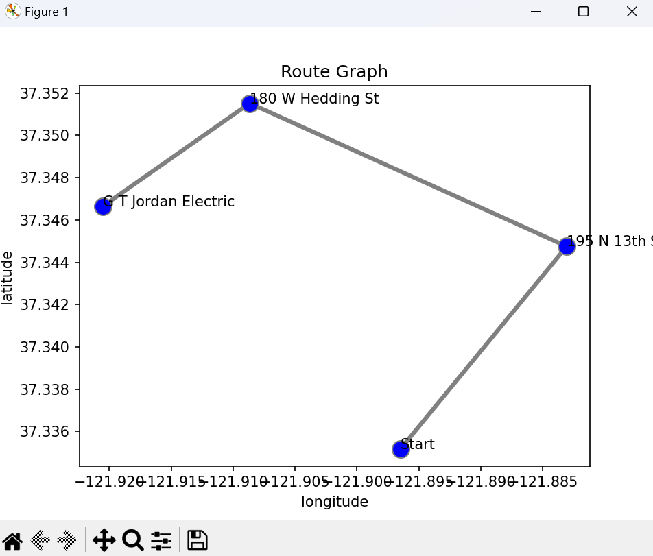

# GEOROUTE - Google Maps Distance Scraper

## A python script that scrapes data from google maps and returns a plot of the shortest route between addresses

Steps to use the bot:

1. Download chromedriver
   https://chromedriver.chromium.org/downloads
2. Add the driver path to the scraper.py file
3. Edit data.py file for desired addresses and starting location.

Note:
Bot uses google maps ui for searching and scraping, so any errors would need to be dealt with by updating the bot's searching method.

### Provide:

(Required) A home address
(Required) One or more 'destination' addresses in an array

```python
home = "16 N Almaden Ave, San Jose, CA 95110"
addresses = ["180 W Hedding St, San Jose, CA 95110", "GT Jordan Electric", "195 N 13th St, San Jose, CA 95112"]
```

### Output:

Results will be written automatically to a file called finalOutput.txt

```
G T Jordan Electric ----- Distance: 1.541 miles
180 W Hedding St, San Jose, CA 95110 ----- Distance: 1.313 miles
195 N 13th St, San Jose, CA 95112 ----- Distance: 0.99 miles
```

And a plot will be generated:


